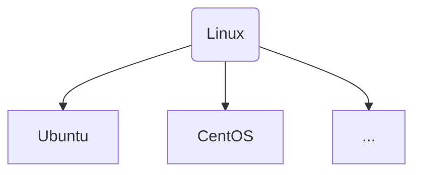
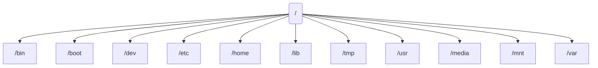

# Linux 


## 목차


- 리눅스란
- 리눅스 구조
- 리눅스 특징 
- Ubuntu 
- 디렉토리 구조
- CLI
- 사용자 계정 


## 리눅스란 ?


하드웨어 - 눈으로보고 만질수있는것 

소프트웨어  -  못보는거 못만지는거 


**리누즈 토발즈 ** 의해 만들어진 OS로 *오픈소스* 개발에 가장 유명한 표본임.

*유닉스 (Unix)*  <-- 유로 


## 리눅스 구조 


카카오톡, Excel Chrome 같은 컴퓨터에서 실행 프로그램을 `응용 프로그램` 이라고 합니다. 

이러한 응용프로그램에서 사용자(컴퓨터를 사용하는 사람)이 명령을 내리면 `Shell` 은 이명령을 해석합니다.

> Shell은 명령 해석기 라고도 함.


해석된 사용자의 입력 명령어를 **Kernel(커널)** 에게 전달

커널이 하드웨어에게 보내줘서 실행이됩니다.


## 리눅스 특징 구조


리눅스는 유닉스 라는 운영체제 기반으로 하고있어요 

뛰어난 안정성과 보안성, 높은 신뢰성과 성능이 특징


시스템 자원을 효율적으로 관리및 사용할수있구요, 멀티유저 와 멀티태스킹 을 지원 


- 멀티유저 : 여러 사용자가 동시에 하나의 시스템에 접근 가능 
- 멀티태스킹 :  여러 개의 작업을 동시에 실행하고, 교대로 컴퓨터의 자원을 사용하는 기능 


CLI , GUI  

> 명령어를 많이 알아야겠죠. 


## 우분투 (Ubuntu)





## 우분투 (ubuntu) 설치


**Windows terminal **


## CLI


PDF 자료 참고


## 디렉토리 구조


최상위 디렉토리

루트디렉토리 


`/`




### 1.1 Root


### 1.2 /bin

기본적인 명령어가 저장된 디렉토리, 리눅스 시스템사용에 있어서 가장 기본적인 명령어들이 저장되어있는곳 

`ls` , `cd` ... 

> ex ) cat, chmod, chown, cp, echo, kill, ls, mkdir, mv, ps, pwd, rm,  su, vi ....


### 1.3 /boot

`리눅스 부트로더(boot loader)` 가 존재하는 디렉토리


### 1.4 /dev

각종 디바이스 파일들이 저장되는공간? 

`블록 디바이스` 와 `캐릭터 디바이스` 


**블록디바이스**

HDD와 같은 주변 장치를 말함

데이터를 블록단위로 읽고 쓰여지며 랜덤하게 엑세스함


**캐릭터디바이스**

입출력이 한 바이트 단위로 이루어지며 데이터가 순차적으로 읽고쓰여짐


### 1.5 /etc


시스템의 거의 모든 설정파일이 존재하는 디렉토리 


`/etc/sysconfig(시스템 제어판용 설정파일)`

`/etc/password(사용자 관리 설정파일)`


**/etc/ssh** :  SSH 서비스 담겨있는 디렉토리

**/etc/hosts** : 도메인의 IP를 찾을때 컴퓨터가 맨 처음 조사하는 파일임 

> window는 C:\windows\System32\Driver\etc\hosts

**/etc/skel** : 계정 사용자 생성시의 초기화 파일이 저장된 디렉토리 (`adduser`) 에서 사용함


### 1.6 /home

사용자의 홈 디렉토리, adduser 명령어로 새로운 사용자를 생성하면 대부분 사용자의 `id`와 동일한 이름의 디렉토리가 자동으로 생성됨


`계정` 설치할때 적었떤 이름 

계정명 입력해주셈!!


### 1.7 /lib


커널모듈과 라이브러리파일


### 1.8 /media


DVD, USB 마운트 <-- 


### 1.9 /mnt


/media 디렉토리와 비슷한 용도 

> WSL2를 사용하는 사람은 window 파일이 담겨져있는 공간 


### 1.10 /var


애플리케이션 실행중에 데이터를 일시적으로 저장하거나, 로그파일들을 저장하는 디렉토리

`/var/log` <-- 여기 디렉토리안에다가 넣어주시면 됩니다. 


## 명령어


### ls


현재 위치의 파일 목록을 조회하는 명령어


**[옵션]**

```
ls -[옵션내용]
```


-  l : 파일들을 상세 정보를 나타냅니다.
- a : 숨김 파일을 표시합니다.


```sh
$ ls -a
```


리눅스에서는 `.` 은 숨김파일이라는 뜻 


```sh
$ ls -al
```


### cd


디렉토리 이동할떄 쓰는명령어


cd 이동할디렉토리


```
cd /

cd ./
```


### mkdir


```sh
mkdir [경로]

# cd / 
cd /home
cd /ingoo
mkdir workspace

mkdir /home/ingoo/workspace
```


### vi


에디터 열기 (파일열기)


- 모드 
  - 명령모드
  - 입력모드


입력모드에 들어가는 방법 `i` 

입력모드에서 명령모드 돌아가는방법은 `esc` 


종료옵션

`:`


- `:q` : 그냥 종료하겠다.
- `:q!` : 강제종료
- `:w` : 그냥 저장
- `:w!` : 강제저장
- `:wq!` : 저장하고 종료하는데 <- 강제


### mv


```sh
$ mv [위치/현재파일] [이동할위치/파일명]
```


```sh
cd ~ # /home/ingoo
vi hello.txt

cd ..
/home

mv ./hello.txt

mkdir sample
mv /home/ingoo/hello.txt /home/ingoo/sample/hello.txt
```


### cp


```
$ cp [위치/현재파일] [이동할위치/파일명]
```


### cat


 파일 이름을 인자로받습니다 

```sh
$ cat 파일명
# result : hello world!
```


### pwd


print working directory 

> 현재 디렉토리를 출력해줌


### who , whoami

로그인한 정보를 보여줌


### env

환경변수

지금 사용하고있는 Linux 컴퓨터에서 사용하고있는 변수를 출력해줍니다.


```sh
echo $home
# 해당변수가 담고있던 값이 출력됩니다.
```


### grep


```sh
$ grep [찾을단어] [파일위치]
$ pwd
# /mnt/c/Users/pc-007/Desktop/blockchain8_1
# hello.txt

$ grep host ./hello.txt
```


### | (pipe line)


명령어를쓰면 출력


env -> PATH

env 결과를 가지고 PATH라는 내용을 가진애들만 보고싶다.


```
env | grep MAIL
```


### ps (Process Status)


- -e : 현재 수행하고있는 프로레스 관한 정보
- -f : 프로세스 ID와 모 프로세스 ID를 포함한 전체리스트를 보여줍니다.


프로세스를 실행할때마다 고유번호가 생김 `pid` 


대부분 많이쓰는게


```sh
$ PS -ef | grep node
```


### kill


```sh
$ kill -9 [프로세스아이디]

$ kill -9 1060
```

