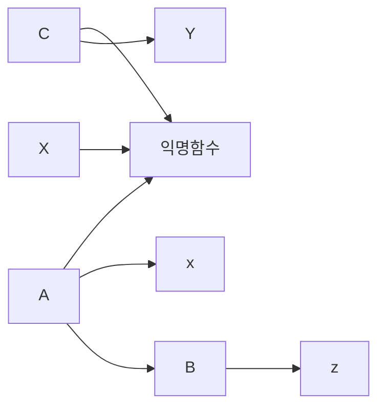

# Javascript


## 1. 함수선언과 호출의 차이를 


**함수선언식**

```javascript
function add(a,b) {
    return a + b
}

function calcuator(func, a, b){
    return func(a,b)
}

calcuator(add,1,2) // 3

```


**함수표현식 (arrow)**

```javascript
const add = (a, b) => a + b
const calculator = (func,a,b) => func(a,b)

calculator(add,1,2) 
```


가장 많이 헷갈리는게 선언과, 호출을 정확히 인지를 못한다는점 


**문제**

```javascript
const add = (a, b) => a + b
document.querySelector('#header').addEventListner('click', add())
// 헤더루를 누르면 안되여. 이벤트가 안먹혀요 
```


**응용문제**


**함수선언식**

```javascript
function clickHandler() {
	return function() {
        console.log('hello world!')
    }
}

document.querySelector('#header').addEventListner('click', clickHandler())
```


**함수표현식**

```javascript
const clickHandler = () => () => { console.log('hello world!') }
document.querySelector('#header').addEventListner('click', clickHandler())
```


> 고차함수를 아는가 ? 
>
> 함수안에서 return 해주는것이 무엇인가. 
>
> 이벤트객체를 어느위치에 적어야하는가.


## 2. 콜스택


```javascript

function c() {
    console.log('c')
}

function a() {
    console.log('a')
    function b() {
        console.log('b')
        c()
    }
    b()
}

a()
c()

// 실행순서를 맞추세요.
```


이 실행 순서를 정확하게 맞추느것이 콜스택을 이해했는가를 검증할수있다.


## 3. 스코프체인

```javascript

function c() {
    const y = 'y'
    console.log('c',x)
}

function a() {
    const x = 'xx'
    console.log('a',x)
    function b() {
        const z = 'z'
        console.log('b',x)
        c()
    }
    b()
}

a()
c()


```


`렉시컬 스코프` 




## 4. This 


함수 실행될때 결정됨.


`Function` 이친구떄문이에요 


- 일반함수로 사용
- 생성자 함수로 사용
- 객체 메서드로 할당


**일반함수**

```javascript
function Foo(a,b) {
	console.log(this) // window
	return [a, b]
}

const foo = Foo(1, 2) // [1, 2]
console.log(foo)
```


**생성자함수**

```javascript
function Foo(a, b){
    //this = {}
    console.log(this)
    this.arr = [a, b]
    //return this
}

const foo = new Foo(1, 2) // Foo { arr: [1, 2] }
console.log(foo)

// this 바인딩 
// function 에다가 this를 주는거에요 다른값
// 동적바인딩
```


**객체 메서드로 할당**

```javascript
function Foo(a,b) {
	console.log(this) // bar
	return [a, b]
}

const bar = {
    method:Foo
}

bar.method(1, 2)
```


## 5. function (this binding)


**간단한 일반함수**

```javascript
function a(){}
console.dir(a)

const b = () => {}
console.dir(b)
```


**function.prototype.bind**

```javascript
function Foo(a,b) {
	console.log(this) // window
	return [a, b]
}


// 1: this 에 넣을 값
// return 함수값을 리턴
const fooBind = Foo.bind({name:'ingoo'})
fooBind(1,2)
```


