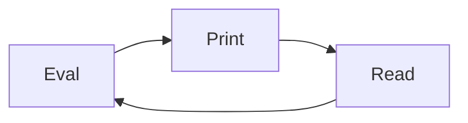

# NodeJs 


**Nodejs 특징**

- 이벤트 기반
- 논블로킹 I/O
  - `프로세스` 와 스레드 
  - 싱글스레드 


프로그램 , 프로세스 


Nodejs 라는 프로그램을 설치 할 줄 알아야 합니다. 

`Linux`	환경에서 설치함. 


`NVM`  

**NodeJs Version Manager**


```sh
$ curl -o- https://raw.githubusercontent.com/nvm-sh/nvm/v0.39.2/install.sh | bash

$ cd ~

$ ls -al
$ vi .zshrc

$ source ~/.zshrc

$ nvm --version # 설치 된것!
$ nvm list
$ nvm install --lts

$ node --version
```


노드라는 프로그램만 설치 !


NodeJS 

- 이벤트 기반
- 논블로킹 I/O
  - `프로세스` 와 스레드 


NodeJs 실행방법


## repl 

- R (Read)
- E (Evaluate)
- P (Print)
- L (Loop)





```sh
$ node
# Ctrl + D
# Ctrl + C , Ctrl + C
```


## Javascript 파일로 실행하기


```sh
$ vi hello.js

# 입력모드 진입
console.log('hello world!')

# 명령모드 (ESC)
## wq!

$ node ./hello.js
```

excel 


**loop.js**

```javascript
setInterval(()=>{
	console.log('hello world!')
},1000)
```


```sh
# 새로운 터미널을 연뒤 linux

ps -ef | grep node
```


```sh
# ctrl + c or ctrl + d 
# 윈도우에서 alt + f4 같은 느낌.

```


## 포그라운드 프로세스, 백그라운드 프로세스 


**Foreground Process**

눈에 보이는거 


**Background Process**

눈에 안보인느거 


```
$ node ./loop.js &
```


백그라운드는 종료를 할려면 프로세스 아이디를 알아야합니다.

`4048`


```sh
$ kill -9 4048
$ ps -ef | grep node
```


## (쓰레드) Thread


멀티스레드

멀티프로세스

싱글스레드 


### Visual Studio Code 에서 사용하기


### 모듈 


`Github` 을 배웠음


한파일에 모든코드를 적으면 불편하다.

코드 오류 추적도 힘들고

협업도 힘듭니다.


파일을 규칙적 맞게 파일을 쪼갭니다. 

모듈이라는 뜻은 우리가 구현할련느 프로그램에 있어서

`작은 단위` 


**list.js**

```javascript
const list = [
    {
        index:0,
        subject:'아반떼',
        date:'22-12-05',
        hit:0
    }
]
```


**view.js**

```javascript
console.log(data)
```


```
node view
```


```
view.js 파일을 실행하면 프로세스
list.js 파일일도 실행해야합니다. 프로세스 

view.js 파일을 실행시키면
list.js 파일을 실행시키기 

require() # nodejs 내장객체 
require(경로입력)


```

