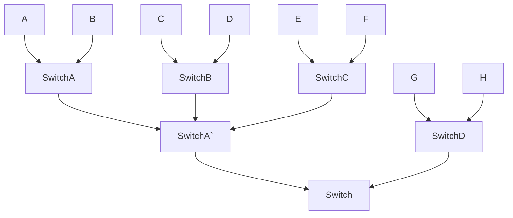

# Network 


### Switch





고속도로 


고속도로 망 

네트워크 망 


고속도로


정리하면

- Routing Table : 이정표 
- Router : 교차로 (L3)
- Packet : 데이터
- Internet : 도로망


## L4 


TCP , UDP 


- TCP 에서는 연결이라는 개념이 있어요 
  - Connection, Session 
- 연결은 순차적으로 진행된다. 
- 상태라는 개념을 가지고있다.
  - 로그인 로그아웃 


## TCP Server ,Client 구축해보기


Nodejs 환경에서 구축해보도록 하겠슴.


내장모듈 `net` 사용함 


```sh
npm init #package.json 
```


**server.js**

```js
const net = require("net")
const PORT = process.env.SERVER_PORT || 3000
const HOST = process.env.SERVER_HOST || "127.0.0.1"

const server = net.createServer((client) => {
    client.on("data", (data) => {
        console.log(data)
    })
})

/*
1: port : 3000
2: host : 127.0.0.1 <-- 내컴퓨터의 host 
3: listen 될경우 실행할 함수 (callback)
*/
server.listen(PORT, HOST, () => {
    console.log(`Server Listening Port : ${PORT}`)
})

```


