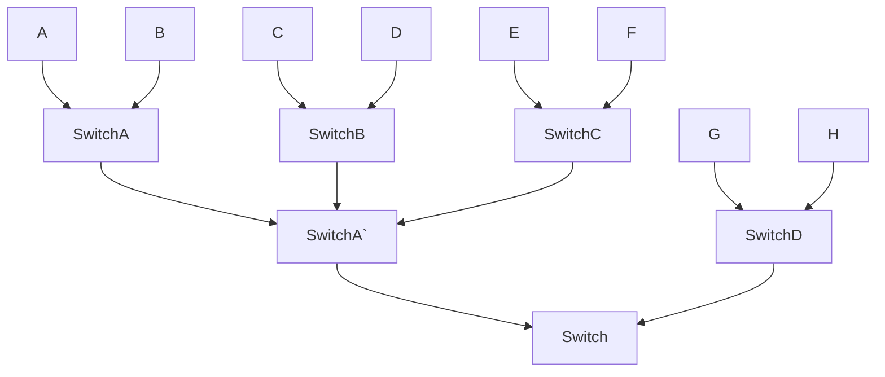

# Network 

### Switch

고속도로 

고속도로 망 

네트워크 망 

고속도로

정리하면

- Routing Table : 이정표 
- Router : 교차로 (L3)
- Packet : 데이터
- Internet : 도로망

## L4 

TCP , UDP 

- TCP 에서는 연결이라는 개념이 있어요 
  - Connection, Session 
- 연결은 순차적으로 진행된다. 
- 상태라는 개념을 가지고있다.
  - 로그인 로그아웃 

