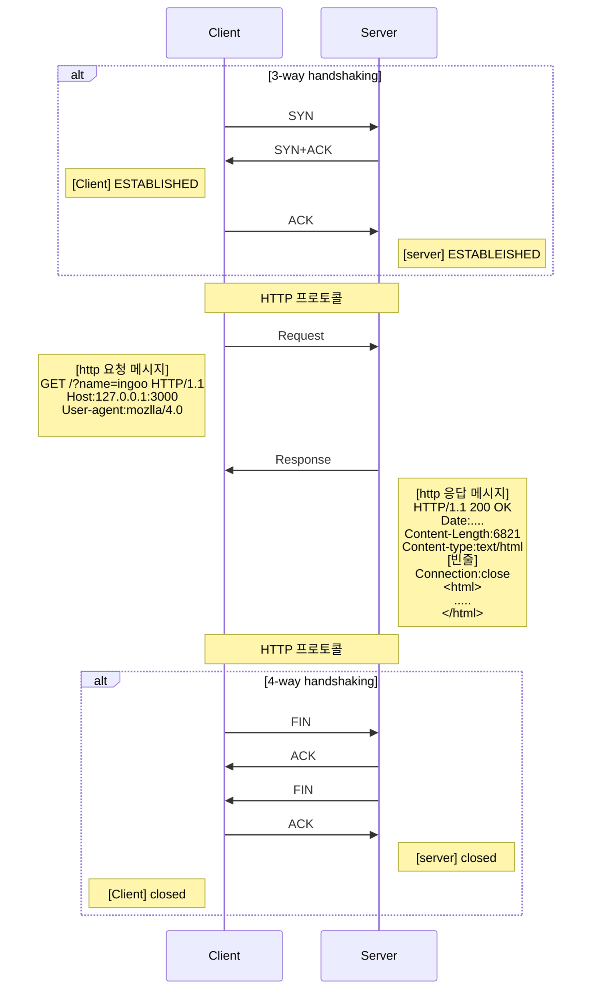

# HTTP 프로토콜 이해


> **Hypertext Transfer Protocol**
>
> HTTP는 서버와 클라이언트가 데이터를 주고 받기 위한 프로토콜 (규칙)


## HTTP 특징


- HTTP는 연결 상태를 유지하지 않는 비 연결성 (Stateless)
  - 연결 후에 TCP연결을 끊는다. 
    - TCP 논리적 연결만 끊는다!
- HTTP 기본골격 요청이 있으며, 무저건 응답을 줍니다.


## HTTP 동작방식


브라우저에서 `URI` 입력시 동작 형태 




### HTTP 요청 메시지

```
GET /user?name=ingoo HTTP/1.1
Host: 127.0.0.1:3000
User-agent:...
Content-type:application/jon

subject=ingoo&content=asdfasdf&date=2022-12-09
{subject:ingoo, content:"asdfasdf",date:"2022-12-09"}
```


일단 요청,응답 메시지는 크게 2가지 형태로 읽어야합니다.

`Header` , `body`  로 구분해서 읽습니다.

requeset header + request body -> request message 


**Start line**

```
GET /user?name=ingoo HTTP/1.1

[요청메서드] [요청 URI] [HTTP 프로토콜 버전]
```


- 요청 메서드 (Request Method)
  - GET :  데이터 요청에 의미로 사용합니다.
  - POST : 데이터 입력의 의미로 사용 
  - PUT : 데이터 수정의 의미 
  - DELETE : 데이터를 삭제하기 위해서 사용 
  - OPTIONS : 웹서버가 지원하는 메서드의 종류 요청 
- 요청 URI
  - host를 제외한 나머지 URI를 적음.
- HTTP 프로토콜 버전
  - HTTP 버전이 1.0 1.1 2.0 이 있는데 우리는 1.1 만 합시다.


**header**

`Content-Type` 의미를 정확하게 아셔야합니다.


**body**

요청 데이터 넣는 공간


## HTTP 응답메시지

```
HTTP/1.1 200 OK
Date : ....
Content-Lenght: 6821
Content-Type: text/html

<html>
.... 내용
</html>
```


**start line**

```
HTTP/1.1
[HTTP 프로토콜버전 버전]

200 상태코드 (Status Code)
OK 상태메시지 (Status Me)
```


1xx : 

2xx : 성공

3xx : ..

4xx : 페이지가 없음 

5xx : 서버터짐 